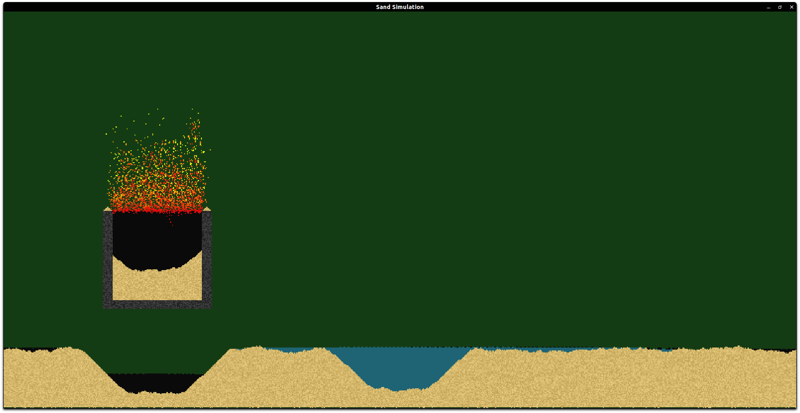

# OpenGL Sand

This project is to create something similar to the old falling sand and Powder Toy browser games. This was meant as an opportunity to exercise knowledge in OpenGL and attempting to see how many individual pixel updates I can push with reasonable performance.
